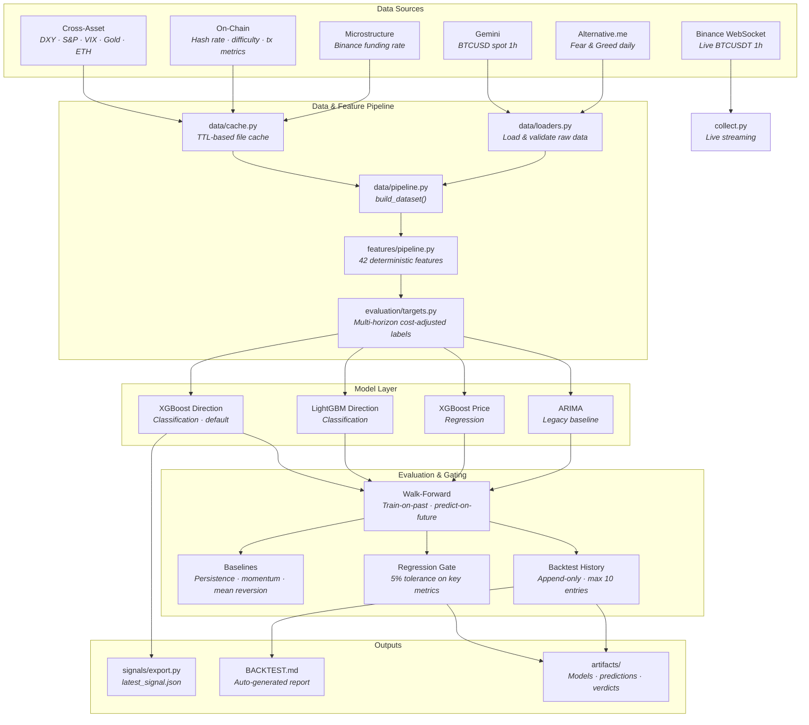

# Bitcoin Signal Research

This repository is a Bitcoin signal-generation, model-research, evaluation, and signal-export repo for a separate trading strategy/execution system.

It does not place trades. It exists to answer one question honestly: is there a Bitcoin signal here that is strong enough to be worth consuming downstream after realistic costs?

The canonical execution plan and progress tracker live in [ROADMAP.md](/home/ixn/Documents/code/crypto/bitcoin-price-analysis/ROADMAP.md).

## Current Judgment

As of March 15, 2026, this repo is `research-only`, not a justified trading-strategy dependency. Phase 12 (data universe expansion) is complete. The best known configuration (LightGBM, 4h horizon, expanded features) clears 2 of 3 integration thresholds (ROC-AUC=0.603, recall=0.183) but precision (0.428) remains below the 0.55 bar. Run `make backtest` to generate `BACKTEST.md` with the latest metrics and history.

## Architecture

<!-- ARCHITECTURE_DIAGRAM_START -->

<!-- ARCHITECTURE_DIAGRAM_END -->

### Directory layout

```text
.
├── data/         # canonical loaders, validation, dataset assembly
├── evaluation/   # targets, baselines, walk-forward evaluation, ablation/comparison,
│                 #   cost simulation (cost_model.py), signal rules (signal_rules.py)
├── features/     # deterministic feature engineering functions + canonical pipeline
├── models/       # model interface, ARIMA baseline, XGBoost, LightGBM
├── signals/      # downstream signal export and validation
├── scripts/      # thin CLI wrappers for comparison, ablation, export
├── tests/        # unit + integration coverage for the research workflow
├── backtest.py   # evaluation entrypoint
├── collect.py    # backfill-first live analytics preparation
├── gen.py        # training entrypoint
├── README.md
└── ROADMAP.md
```

## Source Policy

- Research/training market: `Gemini BTCUSD spot 1h`
- Optional live monitoring market: `Binance BTCUSDT spot 1h`
- Sentiment: `alternative.me Fear & Greed`
- Cross-asset: `yfinance` (DXY, S&P 500, VIX, Gold, ETH-USD)
- On-chain: `blockchain.com` (hash rate, difficulty, tx count/volume)
- Microstructure: `Binance Futures` (funding rate history)
- Canonical timezone: `UTC`

Training and evaluation use one canonical dataset builder in [data/pipeline.py](/home/ixn/Documents/code/crypto/bitcoin-price-analysis/data/pipeline.py). Live analytics bootstrap from that same historical feature state before appending new candles in [collect.py](/home/ixn/Documents/code/crypto/bitcoin-price-analysis/collect.py).

## Core Workflow

Setup:

```bash
python3 -m venv .venv
.venv/bin/pip install -r requirements.txt
```

```bash
make train             # train the default model
make backtest          # walk-forward evaluation + history + regression gate
make test              # run full test suite
make regression-gate   # compare latest backtest against previous run
make compare           # model family comparison
make ablate            # feature ablation
make export-signal     # export latest signal artifact
```

## Backtests

Every `make backtest` run automatically:

1. Runs strict walk-forward evaluation (train-on-past, predict-on-future).
2. Appends the result to `artifacts/backtest_history.json` (max 10 entries, newest first).
3. Regenerates `BACKTEST.md` from the JSON history — latest metrics, acceptance gate status, and a history table for side-by-side comparison.
4. Runs the regression gate, comparing the new result against the previous entry.

`BACKTEST.md` is the place to check current model performance. It is auto-generated and should never be edited manually.

### Acceptance gate

Each run is checked against the provisional integration thresholds:

- precision >= `0.55`
- recall >= `0.15`
- ROC-AUC >= `0.60`

`BACKTEST.md` shows PASS/FAIL for each check.

### Regression gate

After every run, key metrics (precision, recall, ROC-AUC, directional accuracy, F1) are compared against the previous history entry with a 5% relative tolerance. If any metric drops beyond tolerance, the gate prints `REGRESSION DETECTED` and exits with code 1.

Run it standalone with `make regression-gate`. The verdict is also saved to `artifacts/regression_gate_verdict.json`.

### History

The history table in `BACKTEST.md` shows all recent runs side-by-side, making it easy to spot trends or regressions across iterations. The JSON source of truth is `artifacts/backtest_history.json`.

## Data, Feature, and Target Contracts

Canonical feature generation lives in [features/pipeline.py](/home/ixn/Documents/code/crypto/bitcoin-price-analysis/features/pipeline.py). The active feature set includes:

- lagged closes across short and medium lookbacks,
- return and log-return features,
- multi-horizon moving averages and MA spreads,
- RSI,
- volatility and ATR features,
- volume z-scores,
- multi-timeframe trend regime features,
- Fear & Greed sentiment,
- cross-asset features (DXY, S&P 500, VIX, Gold, ETH — Phase 12B),
- on-chain features (hash rate, difficulty, tx count/volume — Phase 12C),
- microstructure features (funding rate — Phase 12E).

Trading-aligned targets live in [evaluation/targets.py](/home/ixn/Documents/code/crypto/bitcoin-price-analysis/evaluation/targets.py):

- `target_close_next`
- `target_simple_return_1`
- `target_log_return_1`
- `target_direction_1`
- `target_direction_cost_adj`
- `target_actionable_move`

The default training target is the cost-adjusted directional label, not raw next-close prediction.

## Evaluation Contract

[evaluation/walk_forward.py](/home/ixn/Documents/code/crypto/bitcoin-price-analysis/evaluation/walk_forward.py) is the canonical scoring harness. It provides:

- strict train-on-past / predict-on-future walk-forward windows,
- baseline comparisons on identical windows,
- timestamped prediction artifacts,
- forecast metrics for regression targets,
- directional metrics for trading-aligned classification targets.

Naive prediction logic remains only as explicit baseline scaffolding in [backtest.py](/home/ixn/Documents/code/crypto/bitcoin-price-analysis/backtest.py).

## Downstream Signal Contract

The first integration mode is a versioned file artifact written by [signals/export.py](/home/ixn/Documents/code/crypto/bitcoin-price-analysis/signals/export.py).

`artifacts/latest_signal.json` contains:

- `timestamp`
- `instrument`
- `model_version`
- `feature_schema_version`
- `signal_schema_version`
- `prediction`
- `probability`
- `actionable`
- `generated_at`

Artifact validation checks required fields and freshness before a downstream repo should accept the signal.

## Artifacts

Current generated artifacts live in `artifacts/` (plus `BACKTEST.md` at the repo root):

- `backtest_history.json` (append-only result log, max 10 entries)
- `regression_gate_verdict.json` (latest regression gate result)
- `dataset_metadata.json`
- `xgboost_direction.joblib`
- `xgboost_direction.metadata.json`
- `xgboost_direction_predictions.csv`
- `xgboost_direction_predictions.summary.json`
- `feature_ablation.json`
- `model_comparison.json`
- `latest_signal.json`

Historical 2025 outputs such as old plots and the legacy ARIMA pickle were removed because they were stale clutter, not evidence.

## Limitations

- The dataset was last refreshed on March 14, 2026 (price through March 13, sentiment through March 14).
- Phase 12 expanded the feature set to 42 features across 5 data families (price/volume, sentiment, cross-asset, on-chain, microstructure). No individual new data family showed clear measurable improvement — expanded data increases recall but degrades precision. The best configuration (LightGBM, 4h, full features) clears 2 of 3 thresholds but precision (0.428) remains below 0.55.
- Data appears to be the main bottleneck for precision, but learner choice and feature selection still affect the tradeoff. Phase 13 (experiment loop) will search the expanded space systematically — including feature subsets, hyperparameters, and threshold tuning — before concluding whether the signal hypothesis should be abandoned.
- `scripts/compare_models.py` exists for reproducible family comparison, but ARIMA evaluation is still materially slower than the tree-based path and should be treated as research tooling, not a fast daily check.

## Autonomous Experiment Loop — Limitations

This repo uses (or will use) an autonomous AI experiment loop inspired by [Karpathy's autoresearch](https://github.com/karpathy/autoresearch) to systematically search the feature/model/hyperparameter space. See Phase 13 in `ROADMAP.md` for full details. The following limitations apply:

**Overfitting risk.** Financial data is far noisier than LLM training data. A metric improvement on walk-forward windows may not generalize. The loop mitigates this with: a held-out validation set never seen during optimization, regime diversity checks (improvements must hold across multiple market conditions), and minimum improvement thresholds to filter noise.

**The loop cannot fix bad inputs.** If the feature set doesn't contain genuine predictive signal, no amount of automated experimentation will find edge. The loop optimizes the search space it's given — it doesn't create new data sources. Phase 12 (rebuild information set and prediction framing) must come first.

**Metric gaming.** An agent optimizing a single composite metric over many iterations will find configurations that score well on that metric but may not represent robust trading signals. The held-out validation set is the final check against this, but it can only be used once.

**Compute cost.** Each experiment runs a full walk-forward evaluation (~10-15 minutes). Running 100 experiments takes ~20 hours. This is a meaningful compute commitment.

**Not a replacement for domain reasoning.** The loop finds what works empirically but doesn't explain why. A feature that improves metrics could be capturing a real market dynamic or could be a coincidence in the evaluation window. Human review of the surviving experiments is still necessary before trusting the results for live trading.

## Decision

This repo is a useful research and signal-export foundation, but not yet a genuinely useful production signal provider. Phase 12 (March 2026) expanded the data universe and identified 4h as the best prediction horizon, but no individual new data family showed clear measurable improvement. The best configuration (LightGBM, 4h, full features) clears 2 of 3 integration thresholds. Phase 13 is justified because Phase 12 created a richer search space and a better target — not because the new data families were validated as signal sources on their own. It should remain research-only until Phase 13 (experiment loop) has systematically searched the expanded space — or until that search concludes the signal hypothesis should be abandoned.
